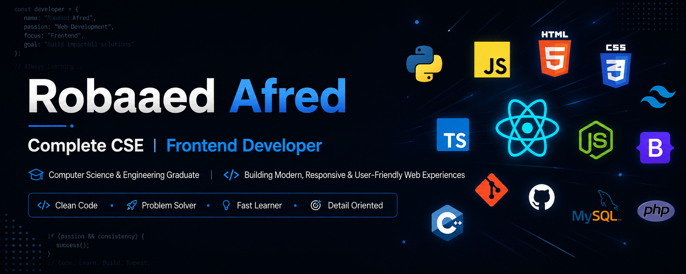

<!-- ======================= BANNER ======================= -->

  

<h1 align="center">Hi 👋, I'm Robaaed Afred Tanik</h1>

<h3 align="center">
  🌱 Aspiring Web Developer | 🤖 AI & Computer Vision Enthusiast
</h3>

  

<!-- ======================= ABOUT ME ======================= -->

## 💫 About Me

👋 I'm **Robaaed Afred Tanik**, a Computer Science & Engineering student and an aspiring web developer who enjoys learning by building real-world projects.

🌱 Currently, I'm focusing on **HTML, CSS, JavaScript, TypeScript, and React.js** while exploring modern frontend development.

🐍 I also have experience with **Python, Machine Learning, and YOLO-based Computer Vision**, especially for object detection and image classification.

🤖 My academic research focuses on **automated banana ripeness grading using advanced YOLO models**, combining **Machine Learning and Computer Vision**.

💡 What makes my journey interesting is my interest in combining **Web Development + AI + Computer Vision** to build practical applications.

### 🚀 Currently I'm...

* 🌱 Learning **React.js & TypeScript**
* ⚛️ Building **frontend projects with React**
* 🔌 Learning how to work with **APIs**
* 🗄️ Exploring **backend development and the MERN stack**
* 🤖 Improving my knowledge of **Python, YOLO & Computer Vision**
* 🛠️ Building projects to strengthen my development skills
* 🎯 Working toward becoming a **Full-Stack Developer**

<!-- ======================= SOCIALS ======================= -->

## 🌐 Connect With Me

<!-- ======================= TECH STACK ======================= -->

## 💻 Tech Stack

<!-- ======================= WHAT I'M LEARNING ======================= -->

## 📚 Currently Learning

  <i>Learning step by step and building projects along the way 🚀</i>

<!-- ======================= GITHUB STATS ======================= -->

## 📊 GitHub Stats

<!-- ======================= CONTRIBUTION ======================= -->

## 🐍 My Contribution Graph

  

<!-- ======================= DEV QUOTE ======================= -->

## ✍️ Random Dev Quote

  

<!-- ======================= GOALS ======================= -->

## 🎯 My Goal

  <b>Learn → Build → Break → Debug → Improve → Repeat 🔥</b>

  <i>Building my skills one project at a time.</i> 🚀

<!-- ======================= FOOTER ======================= -->

  

